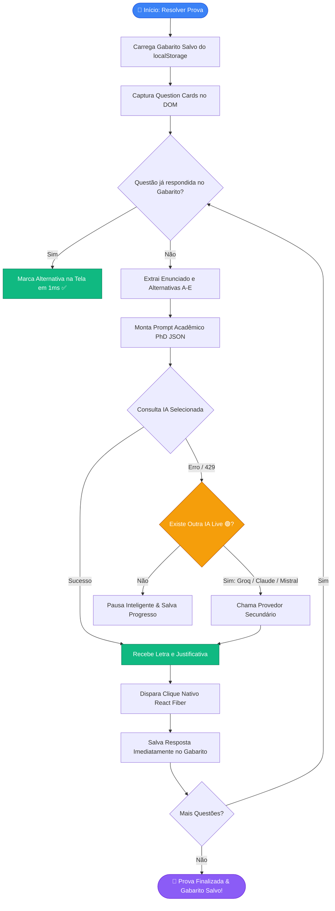
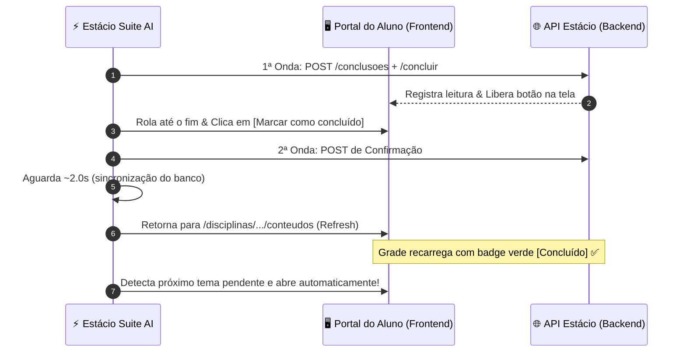

  

<h1 align="center">⚡ Estácio Suite AI v2.0.1</h1>

  <b>A suíte definitiva de IA & automação para estudantes da Estácio: Multi-Provedores (Claude 3.7, Mistral PhD, Groq, Gemini, OpenAI, DeepSeek) com Descoberta Dinâmica de Modelos, Teste Live, Solver Incremental, Gabarito com 2ª Opinião e Auto-Conclusão de Matérias</b>

  
  
  
  
  

  

---

## 🌟 Funcionalidades Principais

### 1. 🎯 Resolução Inteligente e Incremental de Provas (`saladeavaliacoes.com.br`)
- 🤖 **Multi-Provedores com Claude 3.7 Sonnet**: Suporte nativo a Anthropic Claude (`claude-3-7-sonnet-20250219`, `claude-3-5-sonnet`, `claude-3-5-haiku`), Mistral Large PhD, Groq Llama 3.3 70B, Google Gemini, OpenAI GPT-4o e DeepSeek R1.
- 📡 **Descoberta Dinâmica de Modelos (`GET /models`)**: Lista de modelos atualizada diretamente da API oficial de cada provedor em tempo real.
- 🧪 **Teste Live de Chaves (`[🧪 Testar & Salvar]`)**: Testa a conexão com a API antes de ativar o provedor. Apenas IAs com status `Live 🟢` aparecem nas listas de resolução.
- ⏩ **Solver Incremental (Anti-429 & Economia de Cota)**: Se atingir limite de cota durante uma prova, as questões já respondidas ficam salvas no gabarito. Ao clicar novamente, o sistema reaproveita o que já foi feito e consulta a IA **apenas para as questões pendentes**.
- 📝 **Gabarito Persistente com Revisão de 1-Clique**: Badges visuais no widget (`[Q1: B 🔍]...`). Clique em qualquer badge para pedir uma **2ª Opinião** para outra IA sem digitar nada.
- 🖱️ **Clique Nativo React Fiber**: Dispara o `setState` real do React para persistir as marcações com segurança.

---

### 2. 📚 Conclusão Automática de Temas & Matérias (`estudante.estacio.br`)
- 🚀 **Ciclo de 2 Ondas de POST + Clique Ativo**:
  1. **1ª Onda**: Dispara o `POST /conclusoes` para registrar o progresso e liberar o botão na tela (eliminando o timer de espera).
  2. **Clique Físico**: Rola a tela até o final, destrava e clica no botão `[Marcar como concluído]`.
  3. **2ª Onda**: Dispara o POST de confirmação imediata.
- 🔄 **Navegação Determinística**: Retorna diretamente para `https://estudante.estacio.br/disciplinas/{id_materia}/conteudos` (nunca volta para a tela inicial de todas as matérias).
- 🔒 **Deduplicação Estrita por Tema**: Processa perfeitamente temas simples e temas com múltiplos sub-itens (`Tema 1 | 2 Itens`) em loop contínuo até atingir 100% de conclusão.
- 🔑 **Captura Automática de Sessão**: Intercepta o `Bearer token` ativo automaticamente sem necessidade de login manual.

---

### 3. 🎨 Widget Flutuante com Mascote Chibi Animado
- 🐱 **Mascote Anime Dançante**: Animação suave no header do widget e na bolha minimizada.
- 🖱️ **100% Arrastável com Memória de Posição**: Posicione onde preferir; as coordenadas são salvas no `localStorage`.
- 🧹 **Limpeza em 1-Clique**: Botão de vassourinha `[🧹]` para limpar logs, gabaritos e filas acumuladas.
- 📋 **Cópia Silenciosa**: Cópia limpa e instantânea de gabaritos e logs sem poluir o terminal.

---

## 📊 Diagramas de Fluxo & Arquitetura (Mermaid)

### 🔄 1. Pipeline de Resolução de Provas com Retomada Incremental

---

### 🔄 2. Ciclo de Auto-Conclusão de Matérias

---

## 🔑 Banco de Chaves de API (Multi-Keys)

| Provedor | Modelo Padrão | Modelos Disponíveis | Onde Obter Chave |
| :--- | :--- | :--- | :--- |
| **Anthropic Claude** | `claude-3-7-sonnet-20250219` | `Claude 3.7 Sonnet`, `Claude 3.5 Sonnet`, `Claude 3.5 Haiku` | [console.anthropic.com/keys](https://console.anthropic.com/settings/keys) |
| **Groq** *(Ultra Rápido)* | `llama-3.3-70b-versatile` | `Llama 3.3 70B`, `DeepSeek R1 Distill 70B`, `Llama 3.1 8B` | [console.groq.com/keys](https://console.groq.com/keys) |
| **Mistral AI** *(PhD)* | `mistral-large-latest` | `Mistral Large`, `Codestral`, `Mistral Small` | [console.mistral.ai/api-keys](https://console.mistral.ai/api-keys) |
| **Google Gemini** | `gemini-flash-latest` | `Gemini Flash Latest`, `Gemini Pro Latest`, `Gemini 2.5 Flash` | [aistudio.google.com/app/apikey](https://aistudio.google.com/app/apikey) |
| **OpenAI** | `gpt-4o` | `GPT-4o`, `GPT-4o Mini`, `o3-mini` | [platform.openai.com/api-keys](https://platform.openai.com/api-keys) |
| **DeepSeek** | `deepseek-chat` | `DeepSeek V3`, `DeepSeek R1` | [platform.deepseek.com](https://platform.deepseek.com) |

---

## 🛠️ Como Instalar

### Opção A: Userscript (Tampermonkey / Violentmonkey) — *Mais Rápido*
1. Instale o [Tampermonkey](https://www.tampermonkey.net/) no seu navegador.
2. Crie um novo script e cole o código de [`extensao_estacio/estacio_solver.user.js`](./extensao_estacio/estacio_solver.user.js).
3. Salve com `Ctrl + S`.

### Opção B: Extensão do Chrome / Brave / Edge (Manifest V3)
1. Acesse `chrome://extensions/` no seu navegador.
2. Ative o **Modo do desenvolvedor** no canto superior direito.
3. Clique em **Carregar sem compactação** e selecione a pasta `extensao_estacio`.

---

## 📄 Licença
Distribuído sob a licença **MIT**.
