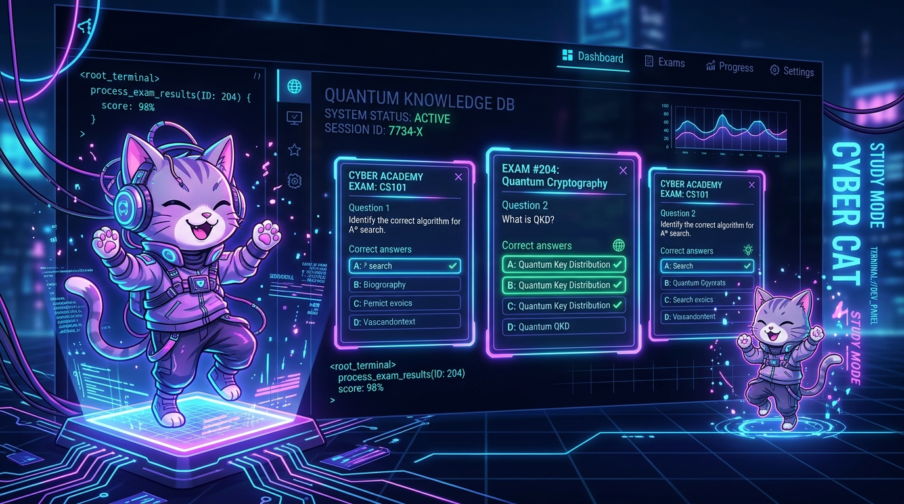
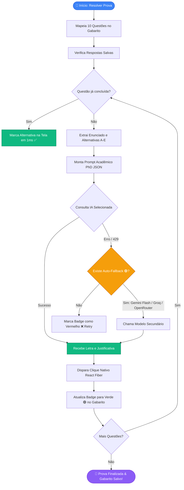
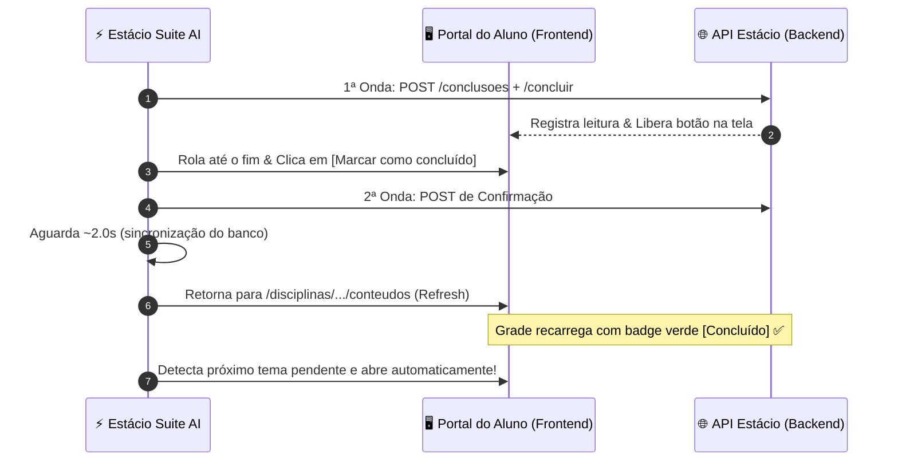

  

<h1 align="center">⚡ Estácio Suite AI v2.5.5</h1>

  <b>A suíte definitiva de IA & automação para estudantes da Estácio: Multi-Provedores (Groq, Gemini, OpenRouter/Hermes, Ollama Local, Mistral, Claude, OpenAI, DeepSeek), Filtro Free/Pagos, Mapeamento Visual de 10 Questões, 1-Click Retry/Revisão, Aplicação Instantânea de Gabarito (0 IA) e Auto-Conclusão de Matérias</b>

  
  
  
  
  

  

---

## 🌟 Novidades da Versão 2.5.5

1. **🗺️ Mapeamento Visual das 10 Questões no Gabarito**:
   - As 10 questões são mapeadas e renderizadas de imediato no painel do widget (`Q1` a `Q10`).
   - Estados visuais em tempo real:
     - 🟢 **Verde (`Qx: [ Letra ] ✅ 🔍`)**: Concluída e marcada com sucesso. Clique para pedir **2ª Opinião / Revisão**!
     - 🔴 **Vermelho (`Qx: ❌ Retry`)**: Questão com falha ou rate-limit. Clique para **Tentar Novamente (Retry Instantâneo)**!
     - 🔄 **Azul Pulsante (`Qx: 🔄`)**: Sendo processada pela IA no momento.
     - ⚪ **Cinza (`Qx: - ⏳`)**: Pendente. Clique para resolver individualmente com 1 clique.

2. **⚡ Botão "Aplicar na Prova" (0 Consumo de IA)**:
   - Se a página recarregar ou as opções desmarcarem, basta clicar em **`[⚡ Aplicar na Prova]`**: o robô lê as respostas já salvas no Gabarito e marca todas as alternativas na tela em segundos sem gastar tokens ou requisições de IA.

3. **🔘 Filtro Inteligente Free / Pagos (`[🟢 Apenas Free]` $\leftrightarrow$ `[💎 Free + Pagos]`)**:
   - Por padrão, exibe apenas modelos 100% gratuitos e de cota livre (Groq, Gemini Flash, OpenRouter `:free`, Ollama local).
   - Com 1 clique no botão toggle, desbloqueia todos os modelos premium e avançados (Claude Opus, GPT-4o, Mistral Large, Hermes 405B).

4. **🎓 Conclusão em Lote de TODAS as Matérias (Multi-Disciplinas)**:
   - Novo botão **`[🎓 Concluir TODAS as Matérias (Lote)]`**: varre automaticamente o catálogo de disciplinas inscritas no semestre (`/disciplinas`), entra em cada matéria pendente, conclui todos os seus temas e aulas via API e DOM, retorna e avança para a próxima matéria até 100% de progresso global.

5. **💃 Mascote Gatinho com Passinho Fortnite**:
   - Animação estilizada e ritmada em 4 tempos no cabeçalho do widget e na bolha minimizada.

6. **🤖 8 Provedores de IA Suportados**:
   - Groq, Google Gemini, OpenRouter (Nous Hermes), Ollama (Local Offline), Mistral AI, Anthropic Claude, OpenAI e DeepSeek.

---

## 📊 Diagramas de Fluxo & Arquitetura (Mermaid)

### 🔄 1. Pipeline de Resolução de Provas com Retomada Incremental

---

### 🔄 2. Ciclo de Auto-Conclusão de Matérias

---

## 🔑 Banco de Provedores e Chaves de API

| Provedor | Modelo Padrão Free | Modelos Disponíveis | Onde Obter Chave |
| :--- | :--- | :--- | :--- |
| **Groq** *(100% Free / Ultra Rápido)* | `llama-3.3-70b-versatile` | `Llama 3.3 70B`, `DeepSeek R1 Distill 70B`, `Llama 3.1 8B` | [console.groq.com/keys](https://console.groq.com/keys) |
| **Google Gemini** | `gemini-2.5-flash` | `Gemini 2.5 Flash`, `Gemini 2.0 Flash`, `Gemini 1.5 Flash`, `Gemini 1.5 Pro` | [aistudio.google.com/app/apikey](https://aistudio.google.com/app/apikey) |
| **Nous Research / Portal** *(100% Free Tier)* | `poolside/laguna-s-2.1:free` | `Poolside Laguna S 2.1 (118B Coding)`, `Meituan LongCat 2.0 (1.6T MoE)`, `Tencent Hy3 (295B MoE)` | [portal.nousresearch.com](https://portal.nousresearch.com) |
| **OpenRouter** *(Free Tier & Router)* | `openrouter/free` | `OpenRouter Free Router`, `Gemma 4 31B`, `Nemotron 3 Ultra`, `GLM 5.2` | [openrouter.ai/keys](https://openrouter.ai/keys) |
| **Ollama** *(100% Local Offline)* | `llama3.3` | `Llama 3.3`, `DeepSeek R1`, `Hermes 3`, `Qwen 2.5`, `Mistral` | [ollama.com](https://ollama.com) |
| **Mistral AI** *(PhD)* | `codestral-latest` | `Codestral Latest`, `Mistral Small`, `Mistral Large` | [console.mistral.ai/api-keys](https://console.mistral.ai/api-keys) |
| **Anthropic Claude** | `claude-3-7-sonnet-20250219` | `Claude 3.7 Sonnet`, `Claude 3.5 Sonnet`, `Claude 3.5 Haiku` | [console.anthropic.com/keys](https://console.anthropic.com/settings/keys) |
| **OpenAI** | `gpt-4o-mini` | `GPT-4o Mini`, `GPT-4o`, `o3-mini` | [platform.openai.com/api-keys](https://platform.openai.com/api-keys) |
| **DeepSeek** | `deepseek-chat` | `DeepSeek V3`, `DeepSeek R1` | [platform.deepseek.com](https://platform.deepseek.com) |

---

## 🛠️ Como Instalar

### Opção A: Userscript (Tampermonkey / Violentmonkey) — *Mais Rápido*
1. Instale o [Tampermonkey](https://www.tampermonkey.net/) no seu navegador.
2. Crie um novo script e cole o código de [`extensao_estacio/estacio_solver.user.js`](./extensao_estacio/estacio_solver.user.js).
3. Salve com `Ctrl + S`.

### Opção B: Extensão do Chrome / Brave / Edge (Manifest V3)
1. Acesse `chrome://extensions/` no seu navegador.
2. Ative o **Modo do desenvolvedor** no canto superior direito.
3. Clique em **Carregar sem compactação** e selecione a pasta `extensao_estacio`.

---

## 📄 Licença
Distribuído sob a licença **MIT**.
