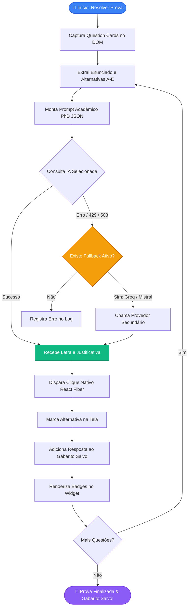
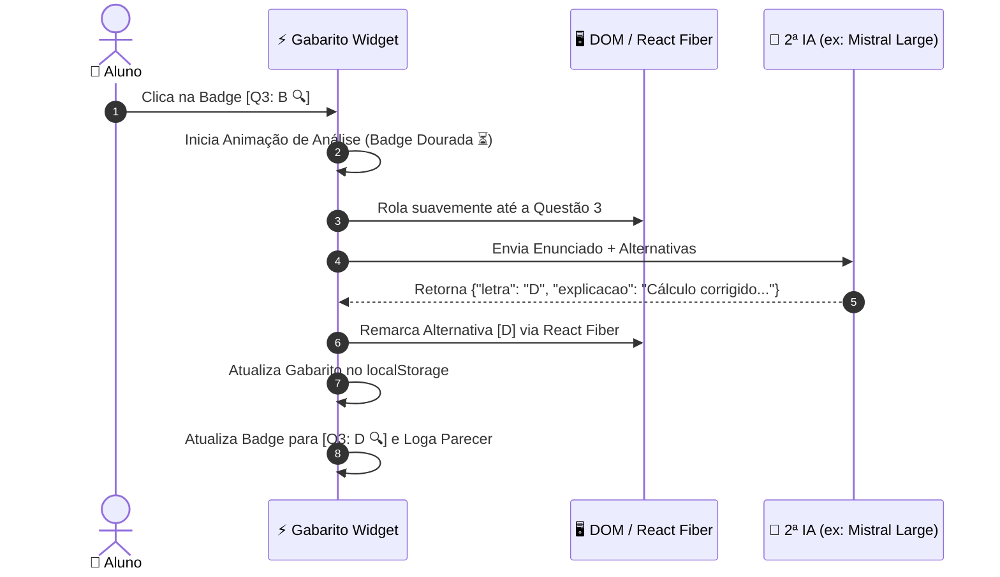
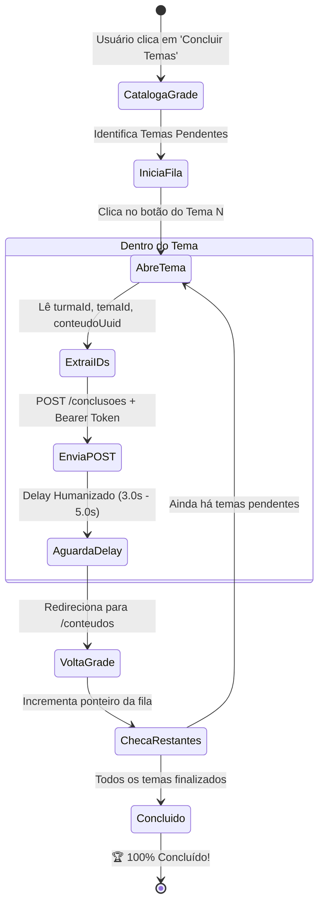
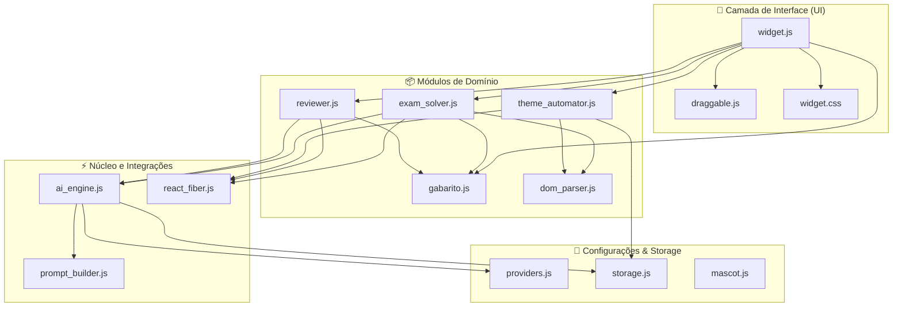

  

<h1 align="center">⚡ Estácio Suite AI (Extension & Userscript)</h1>

  <b>A suíte definitiva de IA & automação para estudantes da Estácio: Solver com Multi-Provedores, Gabarito Persistente com Revisão de 1-Clique e Auto-Conclusão de Matérias</b>

  
  
  
  
  

  

---

## 🌟 Funcionalidades Principais

### 1. 🎯 Resolução Inteligente de Provas & Simulados (`saladeavaliacoes.com.br`)
- 🤖 **Seleção Dinâmica de Provedor & Modelo**: Alterne na hora entre **Groq** (`llama-3.3-70b-versatile`, `deepseek-r1-distill`), **Mistral AI** (`mistral-large-latest`, `codestral-latest`), **Google Gemini** (`gemini-flash-latest`), **OpenAI** (`gpt-4o`, `o3-mini`) e **DeepSeek** (`deepseek-chat`, `deepseek-reasoner`).
- ⚡ **Auto-Fallback Inteligente**: Se a IA principal atingir limite de cota ou instabilidade, o sistema recorre em milissegundos a outra IA salva sem interromper sua prova.
- 📝 **Gabarito Visual Persistente**: Exibe badges com o gabarito completo na interface (`[Q1: B 🔍] [Q2: D 🔍]...`). Persiste contra `F5` / recarregamento de página.
- 📋 **Cópia Instantânea de Gabarito**: Botão de 1-clique para copiar o gabarito formatado e detalhado para a área de transferência.
- 🔍 **Revisão com 1-Clique Direto no Gabarito (Segunda Opinião)**: Dê 1 clique em qualquer badge do gabarito para reavaliar a questão instantaneamente com uma segunda IA (ex: reavaliar questão de cálculo com *Mistral Large PhD*).
- 🖱️ **Clique Nativo React Fiber**: Dispara o `setState` real do React para registrar as marcações de forma 100% persistente no banco da Estácio.

---

### 2. 📚 Conclusão Automática de Temas & Matérias (`estudante.estacio.br`)
- 🚀 **Ciclo Completo com State Machine**: Abre tema $\rightarrow$ extrai IDs de conteúdo $\rightarrow$ envia requisição de conclusão $\rightarrow$ retorna à grade $\rightarrow$ avança para o próximo tema pendente.
- ⏱️ **Delays Humanizados**: Intervalos randômicos de 3.0s a 5.0s entre ações para segurança e simulação de uso real.
- 🔑 **Captura Automática de Sessão**: Intercepta o `Bearer token` ativo diretamente das requisições do portal, sem necessidade de login manual.
- 🚫 **Zero Dependência Externa**: Roda 100% no navegador (sem necessidade de instalar Python, Node ou Playwright).

---

### 3. 🎨 Widget Flutuante com Mascote Chibi Animado
- 🐱 **Mascote Anime Dançante**: Mascote chibi de anime dançando no header do widget e na bolha minimizada (`@keyframes catDance`).
- 🖱️ **100% Arrastável (Draggable)**: Arraste a janela ou a bolha minimizada para qualquer canto da tela.
- 💾 **Memória de Posição**: As coordenadas da interface são salvas no `localStorage`, mantendo a posição exata após navegações.
- 🪟 **Modo Minimizável & Ocultável**: Minimize em bolha flutuante (`_`) ou oculte completamente (`✕`).
- 📋 **Logs Interativos**: Acompanhamento detalhado em tempo real com botão de cópia de logs com timestamps.

---

## 📊 Diagramas de Fluxo & Arquitetura (Mermaid)

### 🔄 1. Pipeline de Resolução de Provas & Auto-Fallback

---

### 🔍 2. Fluxo de Revisão de 1-Clique no Gabarito (Segunda Opinião)

---

### ⚙️ 3. State Machine da Conclusão Automática de Temas

---

### 🏗️ 4. Arquitetura Modular do Código (`src/`)

---

## 🛠️ Como Instalar

### Opção A: Userscript (Tampermonkey / Violentmonkey) — *Mais Rápido*
1. Instale a extensão [Tampermonkey](https://www.tampermonkey.net/) no seu navegador.
2. Crie um novo script e cole o conteúdo de [`estacio_solver.user.js`](./estacio_solver.user.js).
3. Salve com `Ctrl + S`.

### Opção B: Extensão do Chrome / Brave / Edge (Manifest V3)
1. Acesse `chrome://extensions/` no seu navegador.
2. Ative o **Modo do desenvolvedor**.
3. Clique em **Carregar sem compactação** e selecione esta pasta `extensao_estacio`.

---

## 📄 Licença
Distribuído sob a licença **MIT**.
